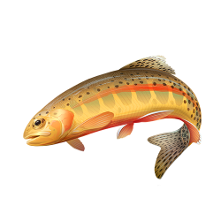

# Fishing Toolkit

A personal field guide to fly fishing the Eastern Sierra: the spots I fish, the species that live here, techniques, hatches, gear, and reports. Notes I keep for myself, shared in case they help someone else chase trout in this part of California.

## Sections

| Section | What's Inside |
| :--- | :--- |
| [Spots](spots/index.md) | Location write-ups from Lone Pine to Bridgeport, plus the Bishop backcountry |
| [Species](species.md) | Trout and other fish of the Eastern Sierra, with range and habitat |
| [Techniques](techniques.md) | How I approach these waters |
| [Hatch](hatch.md) | Hatch calendar and matching resources |
| [Gear](gear.md) | Rods, reels, flies, lures, and packs I use |
| [Reports](reports.md) | Where I check conditions and flows before a trip |
| [Resources](resources.md) | Regulations, guides, and reference sites |

## Map

[Eastern Sierra fishing map with all locations](https://maps.app.goo.gl/uT57e3WJUvDdodhS9?g_st=com.google.Keep.ShareExtension)

